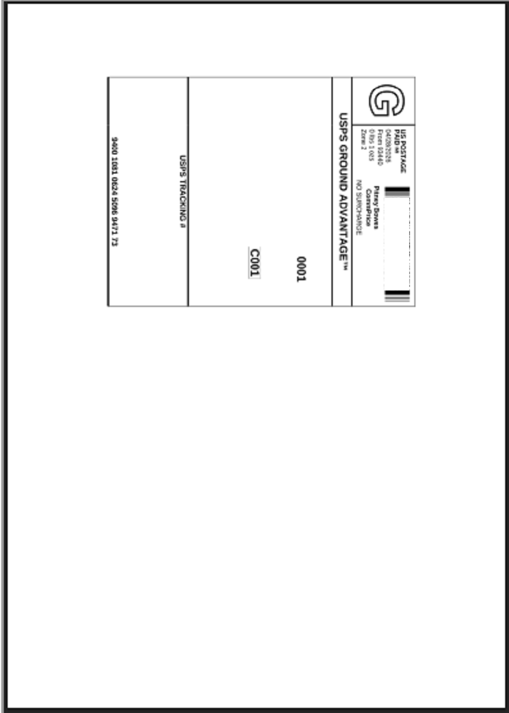
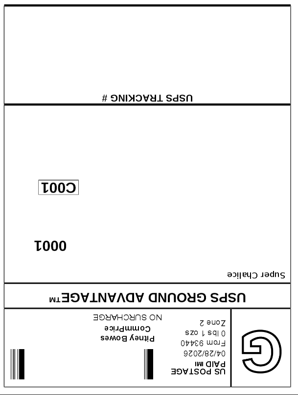

# eBay Shipping Label Cropper

eBay screwed us shippers a while back when they made labels not fit standard printing devices like a Zebra thermal lable printer.

This small Python utility auto-crops shipping label PDFs (eBay, USPS, UPS, FedEx, Pitney Bowes) down to just the label content — so they print cleanly on a 4×6 thermal label printer instead of as a tiny rectangle on a full sheet of paper.

If the image is still not aligned properly, try adjusting to either Portrait or Landscape Mode; And possibly any further settings from there such as Scale percentage.

## Why

Carrier-generated PDFs come on letter-size pages with the actual 4×6 label parked somewhere in a corner. Printing them directly to a thermal printer either scales the whole page down (label becomes unreadable) or chops off half the label. The fix everyone ends up using is "open in Acrobat, manually crop, save, print" — every single time. This automates that.

## Before / After





## Install

```
pip install pymupdf numpy
```

That's it. No poppler, no Ghostscript, no system binaries — `pymupdf` handles PDF rendering natively.

## Usage

Basic:

```
python crop_label.py label.pdf
```

Outputs `label_cropped.pdf` next to the original.

With options:

```
python crop_label.py label.pdf --output ready_to_print.pdf
python crop_label.py label.pdf --margin 12
python crop_label.py label.pdf --rotate 90
python crop_label.py label.pdf --threshold 250
```

### Flags

| Flag | Default | Description |
|---|---|---|
| `--output PATH` | `<input>_cropped.pdf` | Where to write the result |
| `--margin N` | `8` | Padding around detected content, in points (72 = 1 inch) |
| `--rotate {90,180,270}` | none | Rotate after cropping. Useful if your printer wants portrait but the label is landscape on the source PDF |
| `--threshold N` | `240` | Grayscale cutoff for what counts as "white" (0–255). Raise it if the script can't find your content (faint or off-white labels). Lower it to ignore light background noise. |

## Troubleshooting

**Output is blank.** Try a higher `--threshold` (e.g. `250`). Some labels have very light text or watermarks that don't trip the default cutoff.

**Output is too tight against the label edge.** Increase `--margin`.

**Label prints sideways on my thermal printer.** Add `--rotate 90` (or `270` if 90 comes out upside down).

**`No content detected on any page`.** The page is either truly blank or too light. Try `--threshold 250` first; if that still fails, the PDF may use a non-grayscale-renderable encoding and you'd need to inspect it manually.

## Multi-page PDFs

Each page gets its own bounding box detected and cropped independently. If a carrier hands you a 2-page PDF (label + packing slip), both pages get cropped to their own content.

## License

MIT — see [LICENSE](LICENSE).
